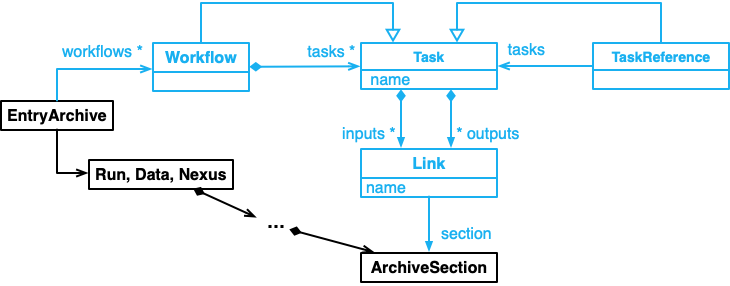

# Workflows in NOMAD

Workflows are an important aspect of data management as they enable for a systematic organization of the _tasks_ performed during any Materials Science research project. We refer to _workflow_ to a series of experiments or simulations already performed and composed of _inputs_, _outputs_, and _tasks_ done in a serial or parallel way. Each workflow will have their _entry_ in NOMAD, from which the rest of the meta-information can be accessed via _references_ to other entries and _sections_.

The full abstract schema present in NOMAD under `nomad.datamodel.metainfo.workflow` can be represented with the following graph:

    

The blue part represents the NOMAD workflow, which is a section of each of the _entries_ in the NOMAD Archive. `Task` contains all the info of each of the _tasks_ performed, while `TaskReference` allow to reference other _tasks_ or _workflows_. Finally `Link` allows to link between _tasks_ and _sections_ in the NOMAD Archive.
<!--Still not happy with this paragraph, but if we want to show this diagram we have to somehow explain it. IMO (@JosePiarro3), the whole diagram is not understable for anyone outside FAIRmat (and probably also within FAIRmat people would have problems understanding this diagram...)-->

This documentation will show you:  <!--Extend this list according to development-->
- A simple tutorial to understand the managing and definition of custom workflows in NOMAD.
- ...