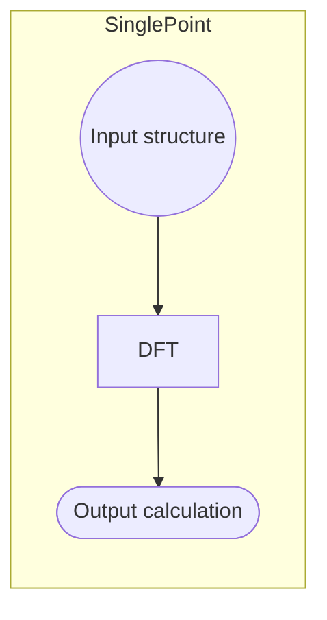

# Workflows in NOMAD


## Introduction

Workflows are an important aspect of data management as they enable for a systematic organization of the _tasks_ performed during a Materials Science research project. We refer to _workflow_ to a series of experiments or simulations already performed and composed of _inputs_, _outputs_, and _tasks_ done in a serial or parallel way. Each workflow will have their _entry_ in NOMAD, from which the rest of the meta-information can be accessed via _references_ to other entries and _sections_.

## Tutorial

We will use a ficticious example of a simulation workflow, where the files and folder structure is:
<!---
Here I should add a href for the files in a zip
-->
```
.
├── pressure1
│   ├── temperature1
│   │   ├── dmft_p1_t1.hdf5
│   │   └── ...extra auxiliary files
│   ├── temperature2
│   │   ├── dmft_p1_t2.hdf5
│   │   └── ...extra auxiliary files
│   ├── dft_p1.xml
│   ├── tb_p1.wout
│   └── ...extra auxiliary files
└── pressure2
    ├── temperature1
    │   ├── dmft_p2_t1.hdf5
    │   └── ...extra auxiliary files
    ├── temperature2
    │   ├── dmft_p2_t2.hdf5
    │   └── ...extra auxiliary files
    ├── dft_p2.xml
    ├── tb_p2.wout
    └── ...extra auxiliary files
```
Each of the _mainfiles_ represent an electronic-structure calculation (either [DFT](https://en.wikipedia.org/wiki/Density_functional_theory), [TB](https://en.wikipedia.org/wiki/Tight_binding), or [DMFT](https://en.wikipedia.org/wiki/Dynamical_mean-field_theory)) which in turn is then parse into a singular entry in NOMAD. When dragged into the NOMAD Upload page, these files should generate 8 entries in total. This folder structure presents a typical workflow calculation which can be represented as a _provenance graph_:
```mermaid
graph LR;
    A((Input structure)) --> B1[DFT];
    A((Input structure)) --> B2[DFT];
    subgraph pressure P<sub>2</sub>
    B2[DFT] --> C2[TB];
    C2[TB] --> D21[DMFT at T<sub>1</sub>];
    C2[TB] --> D22[DMFT at T<sub>2</sub>];
    end
    D21[DMFT at T<sub>1</sub>] --> E21([Output calculation P<sub>2</sub>, T<sub>1</sub>])
    D22[DMFT at T<sub>2</sub>] --> E22([Output calculation P<sub>2</sub>, T<sub>2</sub>])
    subgraph pressure P<sub>1</sub>
    B1[DFT] --> C1[TB];
    C1[TB] --> D11[DMFT at T<sub>1</sub>];
    C1[TB] --> D12[DMFT at T<sub>2</sub>];
    end
    D11[DMFT at T<sub>1</sub>] --> E11([Output calculation P<sub>1</sub>, T<sub>1</sub>])
    D12[DMFT at T<sub>2</sub>] --> E12([Output calculation P<sub>1</sub>, T<sub>2</sub>])
```
Here "Input structure" refers to the _input_ material on which the calculation is performed, "DFT", "TB" and "DMFT" each of the _tasks_ of our calculation, and "Output calculation" the _output_ calculation of each of the final DMFT tasks.

Each task is then parsed into what we call a _SinglePoint_ entry in NOMAD. Our goal is then to set up a custom workflow in which we:
1. Define an extra workflow entry for each pressure P<sub>i=1,2</sub> grouping all SinglePoint "DFT", "TB", "DMFT at T<sub>1</sub>", and "DMFT at T<sub>2</sub>" tasks.
2. Define an extra workflow entry grouping all pressure and all temperature calculations.

### SinglePoint as a starting example

NOMAD is able to [recognize certain workflows in an automatic way](#automatic-workflows). As an example, we will see here the minimal workflow defined by NOMAD, the `SinglePoint` workflow.


Even thought this workflow is automatically recognize by NOMAD, we could imagine define it in our own by adding an extra `<name>.archive.yaml`[^1] file to the upload folder and which has the following content:

```yaml
workflow2:
  name: SinglePoint
  inputs:
    - name: Input structure
      section: '../upload/archive/mainfile/pressure1/dft_p1.xml#/run/0/system/-1'
  outputs:
    - name: Output calculation
      section: '../upload/archive/mainfile/pressure1/dft_p1.xml#/run/0/calculation/-1'
  tasks:
    - m_def: nomad.datamodel.metainfo.workflow2.TaskReference
      task: '../upload/archive/mainfile/pressure1/dft_p1.xml#/workflow2'
      name: DFT at Pressure P1
      inputs:
        - name: Input structure
          section: '../upload/archive/mainfile/pressure1/dft_p1.xml#/run/0/system/-1'
      outputs:
        - name: Output calculation
          section: '../upload/archive/mainfile/pressure1/dft_p1.xml#/run/0/calculation/-1'
```

1. **`name`** keys are optional.
2. **`inputs`** reference the section containing inputs of the whole workflow. In this case this is the section `run[0].system[-1]` parsed from the mainfile in the path `pressure1/dft_p1.xml`.
3. **`outputs`** reference the section containing outputs of the whole workflow. In this case this is the section `run[0].calculation[-1]` parsed from the mainfile in the path `pressure1/dft_p1.xml`.
4. **`tasks`** reference the section containing tasks of each step in the workflow. These must also contain `inputs` and `outputs` properly referencing the corresponding sections; this will then help linking inputs/outputs/tasks in the NOMAD WorkflowVisualizer. In this case this is a `TaskReference` to the section `workflow2` parsed from the mainfile in the path `pressure1/dft_p1.xml`.

This will produce an extra entry with the following Overview content:

<p align="center">
    
</p>

Note that we are referencing sections which are lists. Thus, in each case we have to be careful on referencing the correct section for inputs and outputs (example: a Geometry Optimization workflow calculation will have the "Input structure" as `run[0].system[0]`, while the "Output calculation" would also contain `run[0].system[-1]`)

We can extend these workflow meta-information by adding the metholodogical input parameters. These are stored in NOMAD in the section path `run[0].method[-1]`. The new `single_point.archive.yaml` will be:

```yaml
workflow2:
  name: SinglePoint
  inputs:
    - name: Input structure
      section: '../upload/archive/mainfile/pressure1/dft_p1.xml#/run/0/system/-1'
    - name: Input methodology parameters
      section: '../upload/archive/mainfile/pressure1/dft_p1.xml#/run/0/method/-1'
  outputs:
    - name: Output calculation
      section: '../upload/archive/mainfile/pressure1/dft_p1.xml#/run/0/calculation/-1'
  tasks:
    - m_def: nomad.datamodel.metainfo.workflow2.TaskReference
      task: '../upload/archive/mainfile/pressure1/dft_p1.xml#/workflow2'
      name: DFT at Pressure P1
      inputs:
        - name: Input structure
          section: '../upload/archive/mainfile/pressure1/dft_p1.xml#/run/0/system/-1'
        - name: Input methodology parameters
          section: '../upload/archive/mainfile/pressure1/dft_p1.xml#/run/0/method/-1'
      outputs:
        - name: Output calculation
          section: '../upload/archive/mainfile/pressure1/dft_p1.xml#/run/0/calculation/-1'
```

which produces:

<p align="center">
    
</p>


## Pressure workflow

Now that we now the basics of the custom workflow YAML schema, let's try to define a workflow for each given pressure.

For each of these workflows, the `inputs` for the material is (in the case of P<sub>1</sub>):
```yaml
workflow2:
  name: DFT+TB+DMFT at P1
  inputs:
    - name: Input structure
      section: '../upload/archive/mainfile/pressure1/dft_p1.xml#/run/0/system/-1'
```
While there are two `outputs` at two temperatures (in the case of P<sub>1</sub>):
```yaml
  outputs:
    - name: Output DMFT at P1, T1 calculation
      section: '../upload/archive/mainfile/pressure1/temperature1/dmft_p1_t1.hdf5#/run/0/calculation/-1'
    - name: Output DMFT at P1, T2 calculation
      section: '../upload/archive/mainfile/pressure1/temperature2/dmft_p1_t2.hdf5#/run/0/calculation/-1'
```
Now, `tasks` are defined for each of the methodologies performed. If properly defined, `inputs` and `outputs` inside each `task` will be able to link among them. For simplicity, we will skip referencing to methodologies. Then:
```yaml
  tasks:
    - m_def: nomad.datamodel.metainfo.workflow2.TaskReference
      task: '../upload/archive/mainfile/pressure1/dft_p1.xml#/workflow2'
      name: DFT at P1
      inputs:
        - name: Input structure
          section: '../upload/archive/mainfile/pressure1/dft_p1.xml#/run/0/system/-1'
      outputs:
        - name: Output DFT at P1 calculation
          section: '../upload/archive/mainfile/pressure1/dft_p1.xml#/run/0/calculation/-1'
    - m_def: nomad.datamodel.metainfo.workflow2.TaskReference
      task: '../upload/archive/mainfile/pressure1/tb_p1.wout#/workflow2'
      name: TB at P1
      inputs:
        - name: Input DFT at P1 calculation
          section: '../upload/archive/mainfile/pressure1/dft_p1.xml#/run/0/calculation/-1'
      outputs:
        - name: Output TB at P1 calculation
          section: '../upload/archive/mainfile/pressure1/tb_p1.wout#/run/0/calculation/-1'
    - m_def: nomad.datamodel.metainfo.workflow2.TaskReference
      task: '../upload/archive/mainfile/pressure1/temperature1/dmft_p1_t1.hdf5#/workflow2'
      name: DMFT at P1 and T1
      inputs:
        - name: Input TB at P1 calculation
          section: '../upload/archive/mainfile/pressure1/tb_p1.wout#/run/0/calculation/-1'
      outputs:
        - name: Output DMFT at P1, T1 calculation
          section: '../upload/archive/mainfile/pressure1/temperature1/dmft_p1_t1.hdf5#/run/0/calculation/-1'
    - m_def: nomad.datamodel.metainfo.workflow2.TaskReference
      task: '../upload/archive/mainfile/pressure1/temperature1/dmft_p1_t1.hdf5#/workflow2'
      name: DMFT at P1 and T2
      inputs:
        - name: Input TB at P1 calculation
          section: '../upload/archive/mainfile/pressure1/tb_p1.wout#/run/0/calculation/-1'
      outputs:
        - name: Output DMFT at P1, T2 calculation
          section: '../upload/archive/mainfile/pressure1/temperature2/dmft_p1_t2.hdf5#/run/0/calculation/-1'
```
We can note here:

- The `inputs` for each subsequent step are the `outputs` of the previous step.
- The final two `outputs` coincide with the `workflow2` `outputs`.

This workflow `pressure1.archive.yaml` file will then produce an entry with the following Overview page:

<p align="center">
    
</p>

Similarly, for P<sub>2</sub> we can upload a new `pressure2.archive.yaml` file with the same content, except when substituting 'pressure1' and 'p1' by their counterparts. This will produce a similar graph than the one showed before.


## Full calculation workflow

After adding the workflow YAML files, our upload folder structure now looks like:
```
.
├── pressure1
│   │   ├── dmft_p1_t1.hdf5
│   │   └── ...extra auxiliary files
│   ├── temperature2
│   │   ├── dmft_p1_t2.hdf5
│   │   └── ...extra auxiliary files
│   ├── dft_p1.xml
│   ├── tb_p1.wout
│   └── ...extra auxiliary files
├── pressure1.archive.yaml
├── pressure2
│   ├── temperature1
│   │   ├── dmft_p2_t1.hdf5
│   │   └── ...extra auxiliary files
│   ├── temperature2
│   │   ├── dmft_p2_t2.hdf5
│   │   └── ...extra auxiliary files
│   ├── dft_p2.xml
│   ├── tb_p2.wout
│   └── ...extra auxiliary files
├── pressure2.archive.yaml
└── single_point.archive.yaml
```
In order to know define the general workflow that groups all pressure calculations, we can reference directly the previous `pressureX.archive.yaml` files as tasks. Still, `inputs` and `outputs` must be referenced to their corresponding mainfile and section paths.

We then create a new `fullworkflow.archive.yaml` with the `inputs`:
```yaml
workflow2:
  name: Full calculation at different pressures for SrVO3
  inputs:
    - name: Input structure at P1
      section: '../upload/archive/mainfile/pressure1/dft_p1.xml#/run/0/system/-1'
    - name: Input structure at P2
      section: '../upload/archive/mainfile/pressure2/dft_p2.xml#/run/0/system/-1'
```
And `outputs`:
```yaml
  outputs:
    - name: Output DMFT at P1, T1 calculation
      section: '../upload/archive/mainfile/pressure1/temperature1/dmft_p1_t1.hdf5#/run/0/calculation/-1'
    - name: Output DMFT at P1, T2 calculation
      section: '../upload/archive/mainfile/pressure1/temperature2/dmft_p1_t2.hdf5#/run/0/calculation/-1'
    - name: Output DMFT at P2, T1 calculation
      section: '../upload/archive/mainfile/pressure2/temperature1/dmft_p2_t1.hdf5#/run/0/calculation/-1'
    - name: Output DMFT at P2, T2 calculation
      section: '../upload/archive/mainfile/pressure2/temperature2/dmft_p2_t2.hdf5#/run/0/calculation/-1'
```
Finally, `tasks` references the previous YAML schemas like:
```yaml
  tasks:
    - m_def: nomad.datamodel.metainfo.workflow2.TaskReference
      task: '../upload/archive/mainfile/pressure1.archive.yaml#/workflow2'
      name: DFT+TB+DMFT at P1
      inputs:
        - name: Input structure at P1
          section: '../upload/archive/mainfile/pressure1/dft_p1.xml#/run/0/system/-1'
      outputs:
        - name: Output DMFT at P1, T1 calculation
          section: '../upload/archive/mainfile/pressure1/temperature1/dmft_p1_t1.hdf5#/run/0/calculation/-1'
        - name: Output DMFT at P1, T2 calculation
          section: '../upload/archive/mainfile/pressure1/temperature2/dmft_p1_t2.hdf5#/run/0/calculation/-1'
    - m_def: nomad.datamodel.metainfo.workflow2.TaskReference
      task: '../upload/archive/mainfile/pressure2.archive.yaml#/workflow2'
      name: DFT+TB+DMFT at P2
      inputs:
        - name: Input structure at P2
          section: '../upload/archive/mainfile/pressure2/dft_p2.xml#/run/0/system/-1'
      outputs:
        - name: Output DMFT at P2, T1 calculation
          section: '../upload/archive/mainfile/pressure2/temperature1/dmft_p2_t1.hdf5#/run/0/calculation/-1'
        - name: Output DMFT at P2, T2 calculation
          section: '../upload/archive/mainfile/pressure2/temperature2/dmft_p2_t2.hdf5#/run/0/calculation/-1'
```

This will produce the following entry and its Overview page:

<p align="center">
    
</p>


## Automatic workflows

There are a few cases where NOMAD is able to recognize certain workflows automatically when processing the uploaded files. The simplest example is all `SinglePoint` calculations, as explained above.

Other workflows, like `GeometryOptimization`, `Phonons`, `GW`, can be automatically recognize albeit certain conditions on the folder structure applies. Here we leave you some general guidelines to prepare your upload folder and to make it easier for the automatic workflow recognition to work:

- Always organize your files in an **upwards-downwards structure**, i.e., the initial _tasks_ should be upper in the directory tree, while the later _tasks_ lower on it.
- Avoid having to go up and down between folders if some properties are derived between these files. These situations are impossible to predict for the current NOMAD infrastructure.
- Avoid duplication of files in subfolders. If initially you do a calculation A from which a later calculation B is derived and you want to store B in a subfolder, there is no need to copy the A files inside the subfolder B.

The example used throughout this tutorial is a good example of a clean upload which is friendly and easy to work with when defining complex workflows.


## References

- `tasks`:

- `inputs`: keyword used to store all the inputs of a given task.

- `outputs`: keyword used to store all the outputs of a given task.


[^1]: `<name>` can be any custom name defined by the user, but the file **must** keep the extension `.archive.yaml` at the end.